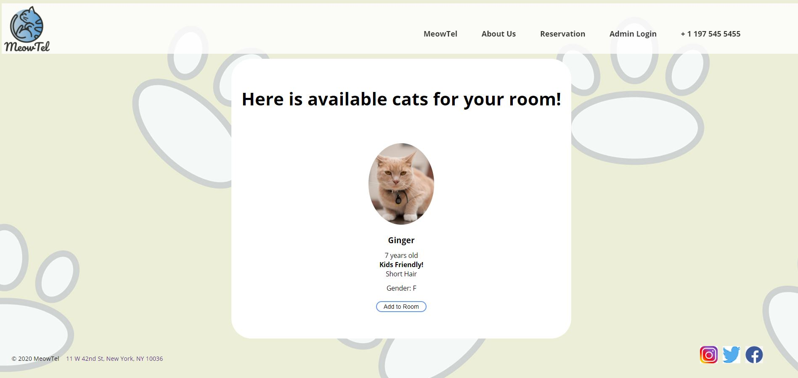

  
  <h1 align="center">MeowTel Website</h1>
  

    This is a dynamic website for a cat hotel with MySQL and PHP.

<!-- ABOUT THE PROJECT -->
## About The Project

### Built With

* HTML/CSS
* PHP
* MySQL

<!-- GETTING STARTED -->
## The Process and What I have learned

### The Process

  This was a part of my group project for my class, where we needed to use HTML/CSS and PHP to
  create a dynamic website where I retrieve all hotel from the database in MySQL.

  This was my first project where I collaborated with other students using GitHub.

### Lesson Learned

As mentioned above, this was my first (or probably second or third?) project that I actively used GitHub to collaborate with other students. And it was awesome because I have finally started understanding how GitHub works in collaboration. Since I have done all the projects by myself, I didn't have many chances to use GitHub except for my last internship as a data engineering intern. 

One of the challenges was to divide the works to do. Because of COVID-19, we could only chat or meet using Zoom to figure out who's working what. I also had to go through lots of merging and pulling errors, and honestly, it was not the most fun part of the project. Sometimes, I was scared to push or pull because somehow, my works would get deleted. After many trials and errors, I understood how GitHub worked better than before and learned to deal with different errors.

Also, I learned to accept criticisms better and to use them to make improvements. It is sometimes hard to take criticisms and feedbacks well, especially if you thought you put all your efforts. But I learned not to be scared of criticisms and faults in my works because that is a great way to improve myself and my works. So I have decided to love all the criticisms and feedback even though it might be something I don't want to hear at the moment.

In the end, I had lots of fun working on this project with my colleagues, and I appreciated all their useful feedback and criticisms. And next time I get to work with others, I hope to see myself improved.
  

